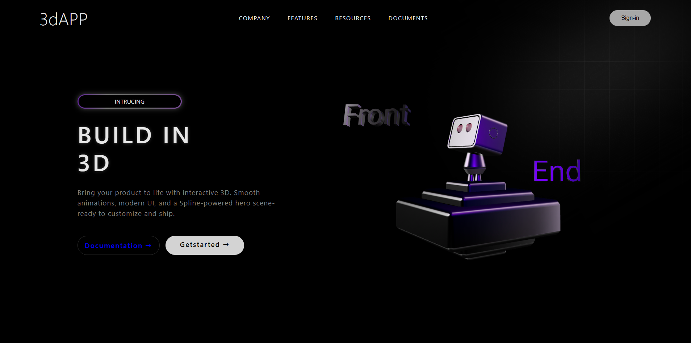

# 3D App Landing Page

#### Landing page dark/minimalista com **hero 3D** (Spline) e animações de entrada usando **AOS (Animate On Scroll)**.

## O que foi implementado
- **Integração 3D** via `<spline-viewer>` (Spline Viewer por CDN)
- **Animações** com **AOS** (fade/zoom, durations e delays no HTML)
- **UI Effects**: imagem de gradiente (`img/gradient.png`) + camada de **blur/glow** (`.layer-blur`)
- **Responsividade** com breakpoints:
  - `@media (max-width: 1300px)`: ajusta padding do header, posicionamento/escala do 3D e espaçamento do conteúdo
  - `@media (max-width: 768px)`: oculta o menu (`nav`), reduz tipografia/botões e reescala/reposiciona o 3D

## Tecnologias
- HTML5 ([index.html](index.html))
- CSS3 ([styles.css](styles.css))
- Spline Viewer (CDN)
- AOS (CDN)

## Estrutura do projeto
- [index.html](index.html)
- [styles.css](styles.css)
- `img/` (assets locais, ex.: `img/gradient.png`)

## Como rodar (Windows / VS Code)
### Opção 1 — Live Server (recomendado)
1. Abra a pasta do projeto no VS Code
2. Clique com o botão direito em `index.html` → **Open with Live Server**

### Opção 2 — Abrir no navegador
- Dê duplo clique em `index.html`

## Configurações principais
- **Cena 3D (Spline)**: URL configurada no atributo `url` do `<spline-viewer>` em `index.html`
- **AOS**: inicializado no final do `index.html` com `AOS.init()` (animações controladas por `data-aos-*`)

## Créditos / Referência
Projeto desenvolvido seguindo o tutorial do canal **MiladiCode**:

>YouTube: https://youtu.be/oskiEydAaok?si=ZdBv7DgTDSSZayc_

